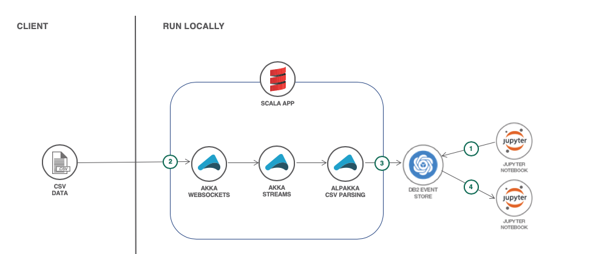

# Online retail order streaming with Akka and Db2 Event Store

In this code pattern, we will build a Scala app that uses Akka to
implement a WebSockets endpoint which streams data to a Db2 Event Store
database. Our example data is online retail order details in CSV format.
We'll use Jupyter notebooks to visualize the data.

When the reader has completed this Code Pattern, they will understand how to:

* Implement WebSockets with Scala and Akka
* Use Alpakka Flows for CSV parsing and inserts into Event Store
* Use Jupyter notebooks and Scala to interact with Event Store
* Use Spark SQL and Brunel visualizations to analyze the data

<!-- 

-->

## Flow
1. Setup the database with a Jupyter notebook.
2. Submit CSV data via WebSockets.
3. Use Akka and Alpakka to transform the data and feed it into Event Store.
4. Present the data with Brunel visualizations in a Jupyter notebook.

<!--
# Watch the Video
[](https://www.youtube.com/watch?v=Jxi7U7VOMYg)
-->

# Steps

## Run locally

1. [Clone the repo](#1-clone-the-repo)
1. [Install IBM Db2 Event Store Developer Edition](#2-install-ibm-db2-event-store-developer-edition)
1. [Run the database setup notebook](#3-run-the-database-setup-notebook)
1. [Run the Scala app](#4-run-the-scala-app)
1. [Feed in data](#5-feed-in-data)
1. [See the results](#6-see-the-results)

### 1. Clone the repo

Clone the `db2-event-store-akka-streams` repo locally. In a terminal, run:

```
git clone https://github.com/IBM/db2-event-store-akka-streams
```

### 2. Install IBM Db2 Event Store Developer Edition

Install IBM® Db2® Event Store Developer Edition on Mac, Linux, or Windows by following the instructions [here.](https://www.ibm.com/support/knowledgecenter/en/SSGNPV/eventstore/desktop/install.html)

> Note: This code pattern was developed with EventStore-DeveloperEdition 1.1.4

### 3. Run the database setup notebook

The git repo includes a Jupyter notebook which is used to setup the database
for this code pattern. The notebook also demonstrates basics such as:
* Create a database
* Create a table
* Query a table

#### Import the Notebook

Use the Db2 Event Store UI to create and run the notebook.

1. From the  upper-left corner `☰` drop down menu, select `My Notebooks`.
1. Click on `add notebooks`.
1. Select the `From File` tab.
1. Provide a name.
1. Click `Choose File` and navigate to the `notebooks` directory in your cloned repo. Select the file `online_retail_database_setup.ipynb`.
1. Scroll down and click on `Create Notebook`.
The new notebook is now open and ready for execution.

#### Run the notebook

1. Edit the `host` constant in the first code cell. You will need to enter your host's IP address here.
2. Run the notebook using the menu `Cell  ▷ Run all` or run the cells individually with the play button.

### 4. Run the Scala app
### 5. Feed in data
### 6. See the results

The git repo includes a Jupyter notebook which is uses Spark SQL and
Brunel visualizations to manipulate and present the data.

#### Import the Notebook

Use the Db2 Event Store UI to create and run the notebook.

1. From the  upper-left corner `☰` drop down menu, select `My Notebooks`.
1. Click on `add notebooks`.
1. Select the `From File` tab.
1. Provide a name.
1. Click `Choose File` and navigate to the `notebooks` directory in your cloned repo. Select the file `online_retail_orders.ipynb`.
1. Scroll down and click on `Create Notebook`.
The new notebook is now open and ready for execution.

#### Run the notebook

1. Edit the `host` constant in the first code cell. You will need to enter your host's IP address here.
2. Run the notebook using the menu `Cell  ▷ Run all` or run the cells individually with the play button.


<!--
# Sample output


-->

# License
[Apache 2.0](LICENSE)

